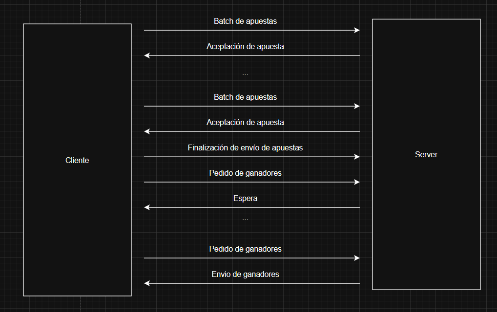

## Ejecución (revisar)
### Ej 1
```
./generar-compose.sh docker-compose-dev.yaml 5
```
### Ej 2
```
make docker-compose-up
```
### Ej 3
```
make docker-compose-up
./netcat_test.sh
```
### Ej 4
```
./generar-compose.sh docker-compose-dev.yaml 5
make docker-compose-up
```
### Ej 5
```
./generar-compose.sh docker-compose-dev.yaml 5
make docker-compose-up
```
### Ej 6
```
./generar-compose.sh docker-compose-dev.yaml 5
make docker-compose-up
```
### Ej 7
```
./generar-compose.sh docker-compose-dev.yaml 5
make docker-compose-up
```
### Ej 8
```
./generar-compose.sh docker-compose-dev.yaml 5
make docker-compose-up
```
## Protocolo
Se optó por un sistema de tamaño fijo de mensajes. Dado que la información del máximo de la cantidad de chunks se encuentra en el cliente y no en el servidor no se calcula un largo máximo fijo preestablecido, sino que se toma el máximo establecido de 8kb por mensaje. Cada mensaje se llena de un caracter '$' para que el largo del mensaje sea de 8kb. Para simplificar la lectura se omite dicho padding en los siguientes ejemplos.

### Ejemplo de comunicación


### Mensajes
Se toma como principal separador al caracter '!', y el primer caracter delimita el tipo de mensaje. Los mensajes son los siguientes
#### Batch de apuestas
    1!Santiago Lionel_Lorca_30904465_1999-03-17_2201_!Agustin Emanuel_Zambrano_21689196_2000-05-10_9325_!Matias_Perez_22332232_1998-02-15_1234_

    Si arranca con un número es un envío de apuestas, dicho número indica la agencia. Luego cada item corresponde a una apuesta particular, y en cada apuesta particular se utiliza un separador secundario '_', separando los campos de nombre, apellido, dni , fecha de nacimiento y numero de apuesta.
#### Aceptación de apuesta
    R!
#### Finalización de envio de apuestas
    N!
#### Pedido de ganadores
    A!
#### Espera
    S!
#### Envio de ganadores
    W!43030690!43030691
    
    Cada ganador se encuentra separado por el separador general.


## Concurrencia

Al crearse el servidor, se crean N procesos (N siendo la cantidad de agencias), cada uno con una queue propia por la cual se les van asignando sockets de conexiones entrantes. Se tiene además un Value booleano con su respectivo Lock el cual indica si el server se encuentra activo o si se debe cerrar para dar por finalizados los procesos.

Los procesos también cuentan con un Lock para la escritura y lectura del archivo de apuestas (La función de store_bets y load_bets) y se tiene otro Value con su respectivo Lock, en este caso un int, el cual tiene el valor máximo de agencias y cada vez que se notifica desde una agencia al servidor que se terminaron de enviar las apuestas esta variable decrece como si fuese una barrera, cuando se encuentra en 0 se da por comenzado el sorteo. Entonces, cuando una agencia pide por los ganadores, es esta misma variable la que contiene la información.
